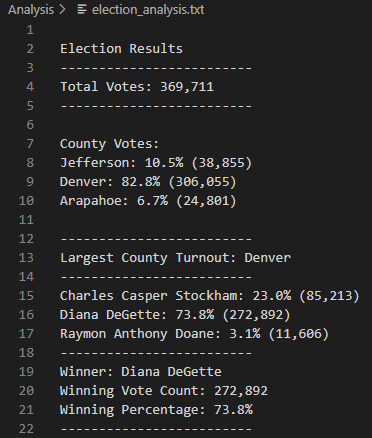

# election-analysis

## Purpose

The purpose of this election analysis is to assist Tom, a Colorado board of elections employee, to determine the outcome of a congressional race for a district in Colorado.  The overall goal is to provide detailed analysis of the results of the congressional race as well as provide a foundation for developing a tool that can be used for any election.

## Election Audit Results

The election analysis tool has proven itself to be able to quickly and accurately assess the results of an election while also providing a breakdown of votes cast by county.

The results of the election are as follows:
* 369,711 votes were cast in total.
* The votes were split across 3 counties.
    * Jefferson county cast 10.5% of the vote with 38,855 votes.
    * Denver county cast 82.8% of the vote with 306,055 votes.
    * Arapahoe county cast 6.7% of the vote with 24,801 votes.
* Denver county cast the highest number of votes from the 3 counties with its total of 306,055, constituting 82.8% of the vote.
* The votes were split between 3 candidates.
    * Charles Casper Stockham received 23.0% of the vote with 85,213 votes.
    * Diana Degette received 73.8% of the vote with 272,892 votes.
    * Raymon Anthony Doane received 3.1% of the vote with 11,606 votes.
* Diana Degette won the election with 272,892 votes, accounting for 73.8% of the vote.

The following is a snapshot of the output file:

A link to the output file can be found here: [election_analsyis.txt](Analysis/election_analysis.txt)

## Summary

The script has demonstrated itself to be able to determine the outcome of a congressional election and, therefore, any election that requires a simple majority.  With some modification, the script could have the power to be used for any election.

### Presidential Elections in the USA

After adding data to the csv input file for which state each vote came from, the script could be modified to calculate the electoral votes that electors will be committed to in a US presidential election.  The same simple majority logic will apply to states that require a simple majority for electoral college votes and modification can be made for states that divide their electoral votes based on total votes for each candidate within the state.  The script could then be modified to sum the results for each candidate and determine which candidate has reached the minimum of 270 electoral votes for victory.

### Presidential Elections in France

The script could be modified to account for the first round of the French presidential elections where the top 2 candidates must be determined if no candidate wins the majority vote.  The script could determine the top two candidates who will move to the second round where the original capability of the script can be utilized to determine the winner of the majority vote.

### Data Integrity

In addition to being applied to different types of elections, the script could also be modified to check for any duplicate votes in the raw data set that may have been missed in the original tallying of votes to generate the csv file to be used as an input.  It could further be modified to verify that voter ID numbers found in the csv file are all representative of only individuals registered to vote in the given election.